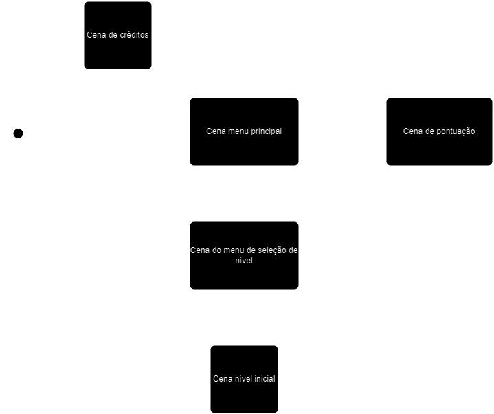

# Song Slide

## Motivação

Desenvolver um jogo em phaser 3 para a cadeira de estágio supervisionado 1 do curso de sistemas de informação da Universidade 7 de Setembro.

## Objetivo

Chegar ao fim de uma fase conseguindo a maior pontuação possível.

## Valor agregado

O aprendizado do ciclo básico de desenvolvimento de um jogo, abordando etapas de concepção da ideia, codificação, documentação, apresentação. 
Além do conhecimento agregado da codificação do jogo em si o que inclui, javascript, iteração entre código e imagens, frames, sprites, cenas.

## Fases

Cada fase do jogo consiste em uma música e ações que devem ser tomadas para chegar ao final.

Ao finalizar uma música a próxima música é liberada, tendo esta um nível de dificuldade maior que a anterior.

Sendo a dificuldade incrementada pela velocidade e precisão em que os comandos devem ser executados.

Todas as fases possuem a mesma mecânica e temática.

As músicas ainda serão definidas.

## Esquema de Pontuação

O jogo trabalha com sistema de pontuação global, o que significa que todos os jogos realizados serão adicionados em somente 1 placar disponível para todos os jogadores, seja via menu inicial ou fim de uma fase.

A pontuação leva em consideração três fatores:

* Dificuldade selecionada
* Nível de precisão da ação tomada
* Fase atual

### Dificuldade selecionada

Neste primeiro existirá somente um nível de dificuldade com peso 1.

### Nível de precisão da ação tomada

A ação do jogador se caracteriza por apertar uma tecla no momento solicitado pelo jogo.

Para cada ação solicitada existe um valor perfeito, caracterizado por uma imprecisão $(I) = 0$.

Cada ação será monitorada e avaliada para verificar a imprecisão (em milisegundos) podendo ser obtidos os seguintes resultados:\
\
$I$ = 0 ms (ação perfeita)\
$I$ > 0 ms (ação atrasada)\
$I$ < 0 ms (ação adiantada)

Para uma ação perfeita não será descontada nenhuma pontuação.

Para uma ação atrasada ou adiantada um valor será descontado da pontuação de uma ação perfeita  ($P$), levando-se em consideração o módulo (ou valor absoluto) da imprecisão ($|I|$), seguindo a seguinte equação:\
\
Pontuação da ação = $p$\
Dificuldade selecionada = $d$\
Fase atual = $f$

$p = ((P - (|I|)) * (d + f)) \over 10$

O resultado **arredondado para baixo** será somado à pontuação total atual.

A pontuação de uma ação perfeita terá um valor padrão de 1000.

Caso a pontuação da ação seja menor que zero, uma vida será retirada (de um total de 3) e nenhum valor será adicionado ou retirado na pontuação total atual.

### Fase atual

A depender da fase selecionada, a pontuação será multiplicada por um peso, sendo este peso correspondente ao desafio proporcionado pelo fase, e o valor resultante será arredondado para baixo.

Por exemplo:

```
A fase 1 tem um peso de 1.
A ação do jogador gerou 35 pontos.
A pontuação adicionada será 35 X 1 = 35 pontos.
```

```
A fase 2 tem um peso de 1,5.
A ação do jogador gerou 35 pontos.
A pontuação adicionada será 35 X 2 = 52,5. O que implica em 52 pontos.
```

## Requisitos

* **Tela inicial**: `Iniciar`, `Ranking`, `Créditos`.
* **Tela de ranking**: `Serão listadas as 10 maiores pontuações`.
* **Tela de seleção de fase**: `Serão listadas as fases disponíveis`.
* **Créditos**: `Lista de colaboradores do projeto`.
* **Fase**: `Cenário onde ocorrerá o jogo em si`.

#### Personas
**Jogador**: Será o usuário do jogo responsável por tomar as ações.

## Protótipos de Tela

